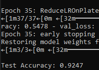
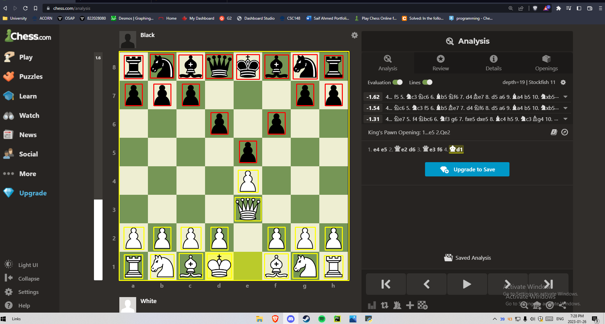

# ChessBot ♟️

ChessBot is a computer vision–powered chess analyzer that detects board positions from images or screenshots and can be hooked up to suggest best moves.  
It is built around a **TensorFlow/Keras** convolutional neural network that classifies the contents of each square, backed by **Python**, **OpenCV**, and **NumPy**.

---

## 🚀 Features
- **Piece classification model** trained on cropped board squares (13 classes: empty + 12 piece types).
- **OpenCV-based preprocessing** for resizing, denoising, and normalizing square images.
- **Dataset pipeline** using `image_dataset_from_directory` for efficient training and validation.
- Designed to plug into a move-suggestion engine (e.g. Stockfish or online analysis tools).

---

## 🧠 Piece classifier

The CNN used to classify each square is defined in `src/chess_piece_classifier.py`.  
After training, the model reaches a **test accuracy of ~92.5%**, as shown below:

The trained model is saved as `src/chess_piece_classifier.keras` and can be loaded to run predictions on new board crops.

---

## 📸 Example detection on chess.com

Below is an example screenshot from an online game where individual squares have been cropped and classified.  
Highlighted squares show where the model has detected pieces on both the white and black sides of the board:

---

## 🛠️ Tech Stack
- **Language**: Python
- **Libraries & Tools**: TensorFlow / Keras, OpenCV, NumPy
- **Other**: Git, VS Code

---

## 📂 Project Structure

- `src/` – core Python source code, including the piece classifier and utility scripts.
- `dataset/` – training and validation images organized by class (one folder per piece/empty square).
- `assets/` – screenshots and figures used in the README.
- `README.md` – project overview and documentation.

---
